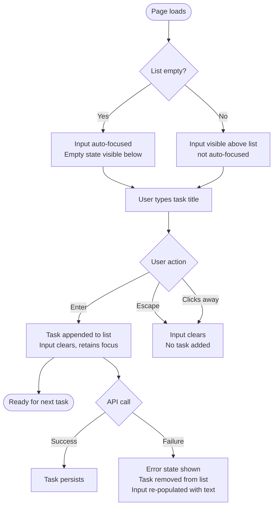
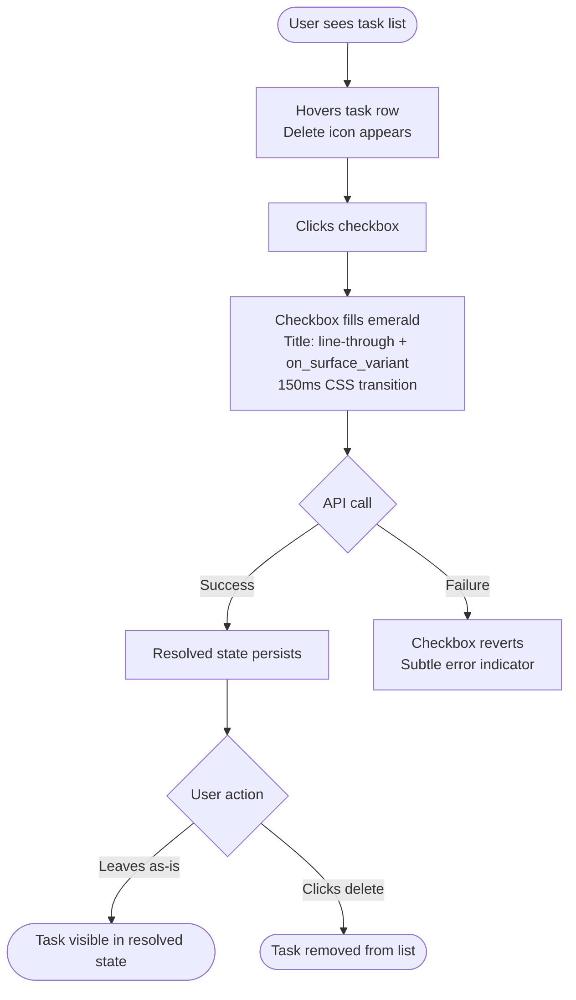
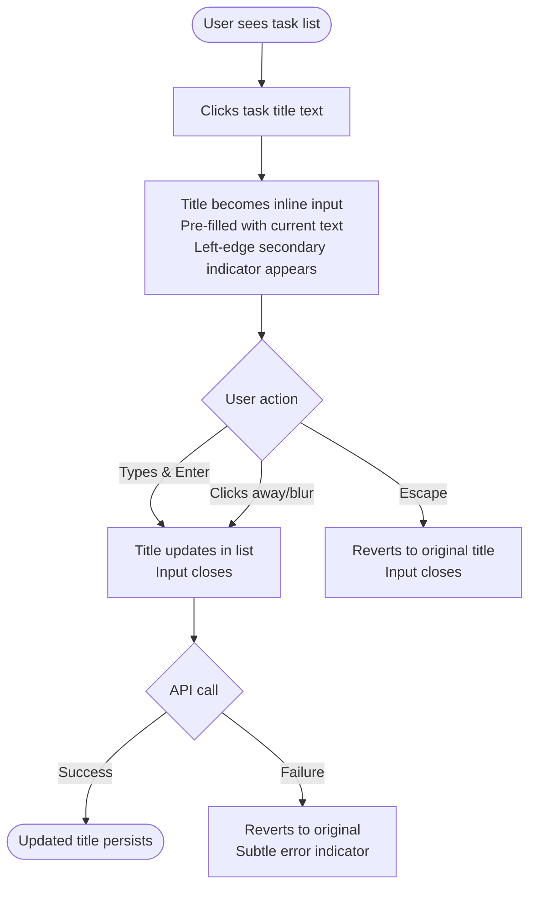
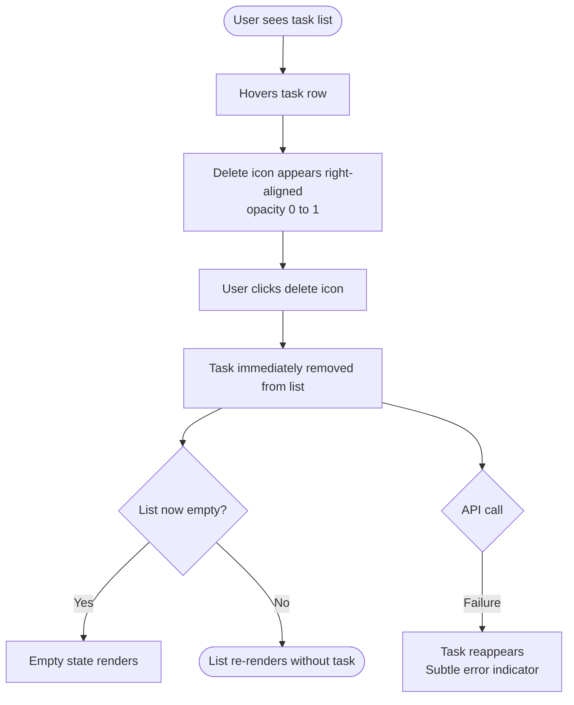
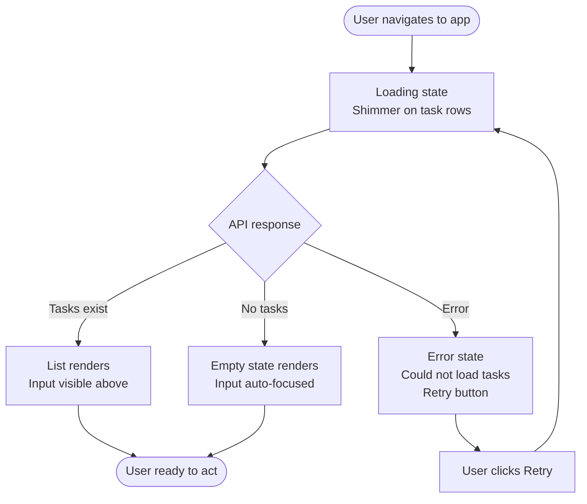

# UX Design Specification leapsome-bmad-todo

**Author:** simopzz
**Date:** 2026-03-26

---

<!-- UX design content will be appended sequentially through collaborative workflow steps -->

## Executive Summary

### Project Vision

leapsome-bmad-todo is a full-stack personal task management web application (Vue 3 SPA + FastAPI) built as a BMAD methodology exercise. It embodies "Editorial Functionalism" — treating every task as a piece of high-end content within a premium, disciplined interface. The experience should feel like editing a curated journal, not managing a database. Scope is intentionally fixed at five interactions; constraint is the differentiator.

### Target Users

A single individual managing personal tasks. No accounts, no collaboration, no onboarding. The user arrives directly at their task list. Implicitly a professional or technically-inclined person who values calm mastery and dislikes feature noise. Device context: primarily desktop web, with responsive considerations for mobile.

### Key Design Challenges

1. **Constraint amplifies every decision**: With only five interactions, there is no feature complexity to absorb poor UX choices. Every spacing, color, and typographic decision carries disproportionate weight.
2. **State handling as first impression**: There is no onboarding. Empty state, loading state, and error state are the only "welcome" experiences — they must be considered first-class design moments.
3. **Design system fidelity under simplicity**: The `DESIGN.md` rules (no 1px borders, tonal layering, ghost-border fallbacks, dual-font hierarchy) are unconventional and strict. The UX spec must translate these into concrete, testable interaction patterns without falling back to standard SaaS defaults.

### Design Opportunities

1. **Task completion as a reward moment**: The emerald accent (`#006C4A`) is reserved as a "laser pointer" — task completion is the natural, high-value trigger for this color. A well-crafted completion interaction becomes the emotional core of the product.
2. **Typography as the primary hierarchy tool**: The Plus Jakarta Sans / Inter dual-font system can carry all information hierarchy without large size jumps or heavy color use — elegant on a minimal surface area.
3. **Whitespace as interaction model**: The no-dividers rule (`spacing-6` between tasks, background shifts instead of lines) means the layout itself communicates structure. Done well, this creates the "premium journal" feel that separates this from commodity todo apps.

## Core User Experience

### Defining Experience

The defining interaction is **task completion** — the moment a user marks a task done. Everything else (add, view, edit, delete) serves this moment. The core loop is: arrive → see your list → act on it → feel accomplished. Viewing and acting on the list happens most frequently; the emotional payoff of completion defines whether the product feels worthwhile.

Adding a task must feel like writing in a notebook — not filling a form. A single input, Enter to submit, immediate appearance in the list. No modals, no required fields beyond the task title.

### Platform Strategy

- **Primary platform**: Desktop web (mouse + keyboard), Vue 3 SPA
- **Responsive**: Mobile-aware layout, but desktop is the primary design target
- **Keyboard-native**: Enter to add, Escape to cancel edit, no mouse required for core actions
- **Always-connected**: No offline requirement; graceful error states handle connectivity issues
- **No native app**: Web only — no PWA install required for v1

### Effortless Interactions

- **List rendering**: Immediate on load — no spinners for the happy path; tasks appear without perceived delay
- **Task entry**: Single-line input, always visible or one click away — never buried in a menu
- **Completion toggle**: One click/tap on the checkbox; no confirmation required
- **Deletion**: Available inline per task; destructive enough to be intentional, not so hidden it's frustrating
- **Edit in place**: Clicking a task title enters edit mode directly — no separate edit screen or modal

### Critical Success Moments

1. **First load** — The user sees their list (or a purposeful empty state) instantly. This is the entire first impression. A broken or slow first load has no onboarding to recover from.
2. **Task completion** — The emerald highlight fires, the task visually resolves. This is the product's emotional core. If it feels flat, the whole experience feels flat.
3. **Task entry** — The user types a task and hits Enter. It appears immediately. If there's lag or a form to fill, the app has failed its premise.

### Experience Principles

1. **Zero to list in one view** — No modal, no sidebar, no navigation required. The list is the application.
2. **Completion is a celebration, not a checkbox** — The emerald moment must feel earned and satisfying, not bureaucratic.
3. **Keyboard-native on desktop** — Power users should complete their entire workflow without touching the mouse.
4. **Empty state is a feature** — The cleared-list or first-time experience must feel intentional and welcoming, never like a broken or unfinished UI.

## Desired Emotional Response

### Primary Emotional Goals

- **Calm mastery** — The user arrives and feels immediately oriented and in control. The interface does not demand attention; it waits, ready.
- **Quiet accomplishment** — Completing a task should produce a small but genuine sense of earned satisfaction — not a badge or confetti, but a visual resolution that feels conclusive.
- **Confidence** — Every action is obvious. There is never a moment of "where do I click?" or "did that save?"

### Emotional Journey Mapping

| Stage | Target Emotion | Design Response |
|---|---|---|
| First load | Grounded, pleasantly surprised | Immediate list render; refined aesthetic sets tone |
| Task entry | Focused, effortless | Single input, keyboard-native, no friction |
| Task completion | Accomplished, rewarded | Emerald fires; task resolves visually with strike-through |
| Error / empty state | Reassured, not abandoned | Purposeful empty state copy; honest, actionable error messages |
| Returning user | Familiar, trusted | Consistent layout; data exactly where left |

### Micro-Emotions

- **Calm** (primary) — Achieved through generous whitespace, muted base palette, no aggressive visual noise
- **Confidence** — One visible action at a time; input always present and prominent; no hidden menus or dropdowns
- **Delight** (subtle) — The emerald accent appearing on completion; the tactile "lift" of `surface_container_lowest` cards on `surface_container_low`
- **Trust** — Immediate persistence; no optimistic UI that lies; errors named honestly
- **Anxiety** (avoid) — Deletion has visual weight but no confirmation modal; destructive but not paranoia-inducing

### Design Implications

- **Calm** → `spacing-6` minimum between tasks; no 1px dividers; muted `surface` base palette; no notification badges
- **Confidence** → Add-task input visible above the list at all times; active state on inputs uses left-edge `secondary` indicator, not a full border wrap
- **Accomplishment** → Completion checkbox fills with `secondary` (#006C4A); task title gets `line-through` + `on_surface_variant` color shift; transition is smooth, not instant
- **Trust** → Edits save on blur or Enter; delete is immediate but the trash icon is subtle at rest, visible on hover — not a danger-red button
- **Avoiding anxiety** → Delete confirmation is skipped (personal tool, low stakes); undo is a desirable v2 feature but not required for v1

### Emotional Design Principles

1. **Earn the emerald** — The `secondary` accent appears only on completion and active inputs. Overuse destroys its emotional weight.
2. **Resolve, don't hide** — Completed tasks are visually resolved (dimmed, struck), not deleted from view unless explicitly removed. The user sees their progress.
3. **Honest error states** — If something fails, say what happened in plain language. Never spinner-loop silently.
4. **Restraint is trust** — Every animation, highlight, and interaction that does NOT exist is a design decision. Absence of noise is its own emotional signal.

## UX Pattern Analysis & Inspiration

### Inspiring Products Analysis

**Things 3 (Cultured Code)**
The reference standard for premium personal todo. Zero onboarding, keyboard-first, typography-led hierarchy with no chrome clutter. Task entry feels like writing in a notebook — natural language, clean single input, instant commit. The completion interaction is widely cited as emotionally satisfying. Completed tasks resolve visually before being archived, letting users see their progress. The app's restraint (no sharing, no collaboration, no dashboards) is a direct precedent for our scope discipline.

**Linear**
The closest analog to "Editorial Functionalism" in the productivity space. Keyboard shortcuts as first-class citizens. Tonal surface hierarchy with no dividers — background color shifts carry all structure. Dense but uncluttered; every interaction has considered weight. Empty states are crafted, not afterthoughts. Their hover-reveal action pattern (icons appear on row hover, invisible at rest) keeps lists visually clean without sacrificing discoverability.

**Obsidian / Notion (editor-mode)**
Reference point for the "journal as canvas" metaphor. Strong precedent for whitespace as structural signal and typography as hierarchy. The lesson here is what *not* to carry over: modal-heavy flows, complexity accumulation, and feature discoverability patterns that assume a power-user learning curve.

### Transferable UX Patterns

**Interaction Patterns:**
- **Inline add input** (Things 3): Input sits at the top of the list, not behind a button or in a modal. Tab/Enter commits the task, Escape cancels — no click required
- **Hover-reveal actions** (Linear): Delete and edit controls appear on task row hover; invisible at rest. Keeps the list clean without hiding functionality
- **Resolved state remains visible** (Things 3): Completed tasks shift to a resolved visual state (dimmed, struck) rather than disappearing immediately. Users see their progress before clearing
- **Keyboard shortcut affordance** (Linear): Subtle `Enter ↵` or `Esc` hints near inputs signal keyboard-first behavior without forcing it on mouse users

**Visual Patterns:**
- **Tonal depth over borders** (Linear): Row hover shifts background from `surface_container_low` to `surface_container_highest` — no outline needed
- **Typography as the only hierarchy** (Things 3): Title weight + color emphasis (`on_surface` vs `on_surface_variant`) carries all information structure; size jumps are minimal

### Anti-Patterns to Avoid

- **Sidebar navigation** (Todoist): Navigation chrome for a 5-action app is scope creep rendered in pixels — explicitly out of scope
- **Modal-heavy editing** (TickTick): A separate edit screen or modal for a task title introduces a navigation layer where none is needed; edit-in-place eliminates this
- **Completion confirmation dialogs**: "Are you sure?" on a low-stakes personal action is anxiety, not safety
- **Gratuitous animation**: Confetti, bouncing checkmarks, or celebratory toasts after completion undermine the calm mastery emotional goal. The emerald moment is the full reward
- **Feature-progressive disclosure** (Notion): Hover menus with 8+ options, slash commands, property panels — all out of scope and contrary to the constraint philosophy

### Design Inspiration Strategy

**Adopt directly:**
- Inline add input above the list (Things 3) — supports keyboard-native, zero-friction entry
- Hover-reveal delete/edit actions (Linear) — keeps visual rest state clean
- Resolved state persists until explicit delete (Things 3) — reinforces accomplishment emotion

**Adapt for our context:**
- Linear's tonal surface hierarchy → already specified in `DESIGN.md`; apply specifically to task card hover and active input states
- Things 3's completion transition → adapt using `secondary` (#006C4A) fill + strike-through rather than a custom animation; simpler and consistent with our design tokens

**Avoid entirely:**
- Any navigation structure beyond a single-page list view
- Modals for CRUD operations
- Confirmation dialogs for completion or deletion
- Animation beyond CSS transitions on state changes

## Design System Foundation

### Design System Choice

**Custom design system** as defined in `DESIGN.md` ("The Disciplined Curator"), implemented via **Tailwind CSS** as the utility layer with custom design tokens.

### Rationale for Selection

- `DESIGN.md` already specifies the complete visual language: palette, typography scale, elevation rules, component behaviors, and explicit do/don't guidelines. The design system decision was made upstream; this step confirms and documents it.
- The "No-Line Rule", tonal layering, and custom checkbox/button specs are fundamentally incompatible with any pre-built component library's defaults (Material Design elevation shadows are explicitly forbidden by `DESIGN.md`).
- Tailwind CSS is the natural implementation vehicle: its utility-first approach maps directly to the token-based design system, and its `theme.extend` configuration makes `DESIGN.md` palette and spacing values directly executable in code.
- Vue 3 + Tailwind is a well-supported pairing with strong ecosystem precedent for the SPA architecture specified in the PRD.
- Five interactions require five bespoke components — no third-party component library adds value at this surface area; it only introduces override complexity.

### Implementation Approach

- **Design tokens**: `DESIGN.md` palette values (`primary_container`, `secondary`, `surface_*`, `on_surface`, `on_surface_variant`) expressed as Tailwind CSS custom properties in `tailwind.config.js`
- **Typography**: Plus Jakarta Sans (display/headlines) + Inter (body/labels) loaded via Google Fonts or self-hosted; applied through Tailwind `fontFamily` config
- **Spacing**: `spacing-6` (1.5rem) as the primary vertical rhythm unit; expressed as a Tailwind spacing scale value
- **Components**: All bespoke — TaskCard, TaskInput, Checkbox, EditableTitle. No third-party component library.
- **Transitions**: CSS `transition` utilities only (Tailwind `transition`, `duration-150`, `ease-in-out`); no JS animation libraries

### Customization Strategy

| Token | Value | Tailwind key |
|---|---|---|
| `primary_container` | `#1E293B` | `colors.primary-container` |
| `secondary` | `#006C4A` | `colors.secondary` |
| `surface` | `#F7F9FB` | `colors.surface` |
| `surface_container_low` | `#F2F4F6` | `colors.surface-low` |
| `surface_container_lowest` | `#FFFFFF` | `colors.surface-lowest` |
| `surface_container_highest` | (hover state) | `colors.surface-highest` |
| `on_surface` | (high emphasis text) | `colors.on-surface` |
| `on_surface_variant` | (medium emphasis text) | `colors.on-surface-variant` |
| `outline_variant` | (ghost border fallback at 15% opacity) | `colors.outline-variant` |

## 2. Core User Experience

### 2.1 Defining Experience

**"Write it down, check it off."**

The core loop is capture → resolve. Both halves must work perfectly; neither is optional. The completion moment is the product's soul — the interaction users will describe when recommending it. Add-task is the entry point; mark-complete is the payoff.

The product's pitch in one sentence: *Add a task and it appears instantly. Check it off and feel done.*

### 2.2 User Mental Model

Users arrive with a **notebook metaphor**: a lined page, a pen, a satisfying cross-through when done. The digital version must feel like that, not like updating a database record.

- Tasks are *written*, not *created*
- Checking off is a *physical act*, not a *status toggle*
- The list is a *surface*, not a *view* — it exists before the user does anything

Current solutions (Todoist, TickTick) break this mental model by treating tasks as records with fields, statuses, and properties. The friction of that paradigm is exactly what this application refuses. Users should never think "how do I save this?" — it just saves.

### 2.3 Success Criteria

- **Add to visible**: < 100ms perceived latency — task appears before the user looks for confirmation
- **Completion transition**: smooth CSS transition (~150ms), never jarring or instant-snap
- **Keyboard flow**: add → Enter → type next → Enter, entire workflow without mouse
- **Empty state**: purposeful and welcoming — not a blank void that reads as "broken"
- **Returning user**: list is exactly where they left it, no re-orientation needed

### 2.4 Novel vs. Established Patterns

**Classification: Established patterns, executed with high fidelity.**

No novel interaction paradigms are required or desired. The innovation is in execution quality and design system fidelity, not in teaching users new mental models. All interactions map to patterns users already know from Things 3, paper lists, and standard web forms:

- Inline text input → commit on Enter
- Checkbox → single click toggles state
- Edit in place → click title to activate inline edit
- Hover to reveal → delete/edit actions appear on row hover

This is correct: zero learning curve preserves the "calm mastery" emotional goal. A novel interaction would introduce anxiety.

### 2.5 Experience Mechanics

#### Add a Task

| Stage | Detail |
|---|---|
| **Initiation** | Input field at top of list, placeholder "What needs doing?"; auto-focused on load when list is empty |
| **Interaction** | User types task title; presses Enter to commit, Escape to cancel |
| **Feedback** | Task appears at bottom of list instantly; input clears and retains focus for next entry; no toast or confirmation |
| **Completion** | Task is in the list — presence is the only feedback needed |

#### Complete a Task

| Stage | Detail |
|---|---|
| **Initiation** | Square checkbox on left edge of task card, visible at rest |
| **Interaction** | Single click or tap |
| **Feedback** | Checkbox fills with `secondary` (#006C4A); task title gets `line-through` + color shifts to `on_surface_variant`; CSS transition ~150ms |
| **Completion** | Task remains visible in resolved state; explicit delete required to remove it |

#### Edit a Task

| Stage | Detail |
|---|---|
| **Initiation** | Click/tap on task title text |
| **Interaction** | Title becomes an inline editable input pre-filled with current text |
| **Feedback** | Left-edge `secondary` indicator appears (2px) on input; background shifts to `surface_container_lowest` |
| **Completion** | Enter or blur saves; Escape cancels and reverts |

#### Delete a Task

| Stage | Detail |
|---|---|
| **Initiation** | Hover over task row reveals delete icon (trash, right-aligned) |
| **Interaction** | Single click on delete icon |
| **Feedback** | Task is immediately removed from list; no confirmation dialog |
| **Completion** | List re-renders without the task; no undo in v1 |

## Visual Design Foundation

### Color System

Sourced from `DESIGN.md` ("The Disciplined Curator"). All tokens are required; none are optional overrides.

| Role | Token | Value | Usage |
|---|---|---|---|
| Primary container | `primary_container` | `#1E293B` | Headlines, branding, primary text authority |
| Accent / action | `secondary` | `#006C4A` | Completion state, active inputs, CTAs — used sparingly |
| Base surface | `surface` | `#F7F9FB` | Page background |
| Secondary layer | `surface_container_low` | `#F2F4F6` | Task list container area |
| Active/card layer | `surface_container_lowest` | `#FFFFFF` | Individual task cards |
| Hover state | `surface_container_highest` | (dark end of scale) | Task row hover background |
| High-emphasis text | `on_surface` | Charcoal (not pure black) | Task titles, primary labels |
| Medium-emphasis text | `on_surface_variant` | Muted charcoal | Metadata, completed task titles, placeholder text |
| Ghost border fallback | `outline_variant` | @ 15% opacity only | Accessibility/high-contrast mode only; never at full opacity |

**CTA gradient**: `linear-gradient(135deg, primary, primary_container)` — applied to primary action buttons only.

**The "No-Line" rule**: No 1px solid borders for sectioning. All boundaries defined by background color transitions between surface tokens.

### Typography System

**Dual-font strategy** per `DESIGN.md`:

| Scale | Font | Weight | Use |
|---|---|---|---|
| Display / Headline | Plus Jakarta Sans | 600–700 | App title, empty state headline |
| Title | Inter | 600 (Semi-Bold) | Task titles (active) |
| Body | Inter | 400 | Task titles (completed, dimmed) |
| Label | Inter | 400–500 | Input placeholder, metadata, button labels |
| Label-sm | Inter | 400 | Secondary metadata (0.6875rem minimum) |

**Hierarchy rule**: Weight + color emphasis (`on_surface` vs `on_surface_variant`) carries hierarchy, not size jumps. A `title-sm` Semi-Bold in `on_surface` outranks a `headline-sm` Regular in `on_surface_variant`.

### Spacing & Layout Foundation

- **Base unit**: 4px
- **Primary vertical rhythm**: `spacing-6` (1.5rem) between task cards — no dividers, ever
- **Card padding**: `spacing-4` (1rem) horizontal, `spacing-3` (0.75rem) vertical
- **Input padding**: `spacing-4` horizontal
- **Max content width**: ~640px, horizontally centered — list never stretches full-viewport (journal metaphor, not spreadsheet)
- **Layout**: Single column, no sidebar, no navigation rail
- **Corner radius**: `xl` (0.75rem) for large containers/buttons; `md` (0.375rem) for small elements (chips, checkboxes)
- **Elevation**: Tonal layering only — `surface_container_lowest` cards on `surface_container_low` container create "ghost shadow" depth. No CSS `box-shadow` on task cards. Modals/floating elements: `box-shadow: 0 12px 40px rgba(25, 28, 30, 0.06)` only.

### Accessibility Considerations

- `on_surface` against `surface_container_lowest` (#FFFFFF): must meet WCAG AA (4.5:1 minimum for body text)
- `secondary` (#006C4A) against white: ~7:1 contrast — passes AAA
- `outline_variant` at 15% opacity is the accessibility-mode fallback only; default UI relies on tonal depth
- Minimum interactive target size: 44×44px (WCAG 2.5.5) for checkboxes and icon buttons
- Focus states: visible keyboard focus ring using `outline_variant` or `secondary` outline — never removed, only styled
- Font floor: `label-sm` (0.6875rem / ~11px) for secondary metadata only; all interactive and primary text at `body-md` (1rem) minimum

## Design Direction Decision

### Design Directions Explored

Six layout directions were generated and evaluated against the established design system and experience principles:

| Direction | Layout Concept | Key Characteristic |
|---|---|---|
| D1 · Minimal Canvas | No card frame, plain list | Closest to paper list / journal feel |
| D2 · Card Stack | Each task as lifted card | Higher tactile depth |
| D3 · Split Panel | Dark sidebar + main area | Adds chrome and stats |
| D4 · Pinned Input | Input fixed above scrolling list | Strong entry-point emphasis |
| D5 · Full-Bleed | No container, white canvas | Maximum restraint |
| D6 · Narrow Focus | 480px max, compact density | Tool feel over app feel |

Reference: `_bmad-output/planning-artifacts/ux-design-directions.html`

### Chosen Direction

**D1 × D4 Hybrid — Minimal Canvas with Pinned Input**

- **Layout base**: D1 Minimal Canvas — no containing card frame, flat list on the surface background, maximum visual restraint
- **Input placement**: D4 Pinned Input — add-task input fixed below the header, always visible above the fold, keyboard-ready on load
- **Task rows**: No card frame; `spacing-6` (1.5rem) whitespace separation between rows; hover shifts background to `surface_container_highest` (no border)
- **Completed tasks**: Remain visible in resolved state (strike-through + `on_surface_variant`) until explicitly deleted
- **Container**: Max 640px, horizontally centered, single column, no sidebar

### Design Rationale

- D1's stripped aesthetic is the most faithful expression of "Editorial Functionalism" — it removes all chrome that doesn't serve the content
- D4's pinned input gives the add-task action permanent visual prominence without stealing space from the list — the input is always ready, never buried
- The hybrid eliminates D1's original `outline_variant` dividers (which violated the "No-Line Rule") in favor of pure whitespace separation
- D3's sidebar was ruled out as scope creep — navigation chrome for 5 interactions is contrary to the constraint philosophy
- D5 was considered but the total absence of any container makes empty states and loading states harder to frame purposefully

### Implementation Approach

- App shell: `max-width: 640px`, centered via `margin: 0 auto`, `background: var(--surface)` page background
- Header section: `background: var(--surface-lowest)`, `padding: 2rem 2rem 1rem`
- Pinned input zone: `background: var(--surface-lowest)`, `border-bottom: 2px solid var(--surface-low)` — one permitted structural color shift (not a 1px line)
- Task list zone: `background: var(--surface-low)`, `padding: 1.5rem 2rem`
- Task rows: `background: transparent` at rest; `background: var(--surface-highest)` on hover; `padding: 0.75rem 0`; no border-radius needed at this stripped level

## User Journey Flows

### Journey 1: Add a Task

### Journey 2: Complete a Task

### Journey 3: Edit a Task

### Journey 4: Delete a Task

### Journey 5: First Load / Return Visit

### Journey Patterns

- **No optimistic UI** — all state changes wait for API confirmation before persisting; trust over perceived speed for personal data
- **Error recovery re-populates** — failed adds restore input text; failed edits revert to original title; nothing silently lost
- **Hover-reveal for destructive actions** — delete icon invisible at rest (`opacity: 0`), appears on row hover; prevents accidental triggers
- **Escape is the universal cancel** — consistent exit key across add input and inline edit

### Flow Optimization Principles

1. **Minimum steps to value**: Add task = 1 action (type + Enter). Complete task = 1 click. No intermediate screens.
2. **Input persistence**: After adding a task, input clears but retains focus — enables rapid sequential entry without re-clicking.
3. **Non-destructive completion**: Marking done doesn't delete — user sees resolved tasks and can delete explicitly. Progress is visible.
4. **Loading skeleton over spinner**: First load shows shimmer rows matching expected task shape — prevents layout shift and feels faster than a centered spinner.

## Component Strategy

### Design System Coverage

The design system is fully custom (per `DESIGN.md`) — no third-party component library. Every component is bespoke, built on Tailwind CSS utility classes with design tokens from `DESIGN.md`. There is no gap analysis between a vendor library and requirements; the spec is the implementation target.

**No third-party components used.** This is intentional: DESIGN.md's rules (no 1px borders, custom checkbox shape, tonal layering, gradient CTAs) are incompatible with any pre-built component library's defaults without constant override battles.

### Custom Components

#### `TaskInput`

| Attribute | Spec |
|---|---|
| **Purpose** | Add new tasks; always pinned below app header |
| **Usage** | Single instance, always visible, never in a modal |
| **Anatomy** | Full-width input field, no visible button |
| **States** | Rest: `surface_container_low` bg / Focused: `surface_container_lowest` bg + 2px `secondary` left-edge indicator |
| **Behavior** | Enter → emits add + clears; Escape → clears, no emit; auto-focused when list is empty |
| **Placeholder** | "What needs doing? Press Enter to add…" |
| **Accessibility** | `role="textbox"`, `aria-label="Add a task"` |
| **Content guidelines** | Single line only; no character limit enforced in UI |

#### `TaskRow`

| Attribute | Spec |
|---|---|
| **Purpose** | Display a single task; hosts all task interactions |
| **Usage** | Repeated in list; `spacing-6` between rows, no dividers |
| **Anatomy** | `[TaskCheckbox] [TaskTitle or InlineEditInput] [ActionIcons]` |
| **States** | Default → Hover (surface-highest bg, icons visible) → Editing (inline input active) → Completed (struck + dimmed) |
| **Behavior** | Click title → inline edit; click checkbox → toggle complete; hover → reveal actions; click delete → emit delete |
| **Keyboard** | Tab between tasks; Space/Enter toggles checkbox when focused; Escape exits edit mode |
| **Accessibility** | `role="listitem"`, delete button `aria-label="Delete task"`, edit input `aria-label="Edit task"` |

#### `TaskCheckbox`

| Attribute | Spec |
|---|---|
| **Purpose** | Toggle task completion state |
| **Shape** | Square, `border-radius: 0.375rem` (md), 18×18px visual, 44×44px touch target via padding |
| **States** | Unchecked: `outline_variant` border, transparent fill / Hover: border shifts to `on_surface` / Checked: `secondary` (#006C4A) fill + white `✓` |
| **Transition** | Fill + checkmark appearance, 150ms ease-in-out |
| **Accessibility** | `role="checkbox"`, `aria-checked`, keyboard activatable via Space |

#### `EmptyState`

| Variant | Icon | Headline | Body |
|---|---|---|---|
| `blank` | ✦ (neutral) | "A clean slate" | "No tasks yet. Add something above and it will appear here." |
| `all-done` | ✓ (secondary green) | "All done" | "Everything's complete. Add something new when you're ready." |

- Typography: Plus Jakarta Sans for headline, Inter for body, centered alignment
- Sits in the list zone below the pinned input
- `blank` shown on first visit or when list is empty; `all-done` shown when all tasks are deleted after having existed

#### `ErrorState`

| Variant | Scope | Message | Action |
|---|---|---|---|
| `load-error` | Full list area | "Couldn't load your tasks" | Retry button (primary gradient) |
| `action-error` | Per-row, inline | Subtle `outline_variant` border flash on affected row | None — silent revert |

- No toast notifications; errors are contextual and non-blocking where possible
- `load-error` is the only full-interruption error state

#### `LoadingSkeleton`

| Attribute | Spec |
|---|---|
| **Purpose** | Replaces task list during initial API fetch |
| **Anatomy** | 3–4 shimmer rows matching `TaskRow` height and layout proportions |
| **Animation** | CSS `@keyframes` shimmer sweep: `surface_container_low` → `surface_dim` → `surface_container_low` |
| **Duration** | Shown only during initial load; never shown on subsequent actions |

### Component Implementation Strategy

- All components are Vue 3 Single File Components (`.vue`) with scoped styles
- Design tokens applied via Tailwind CSS custom properties in `tailwind.config.js`
- Components are self-contained — props in, events out; no direct store access from leaf components
- No animation library — CSS `transition` and `@keyframes` only

### Implementation Roadmap

**Phase 1 — Core (required for any journey to function)**
1. `TaskCheckbox` — atomic; required by TaskRow
2. `TaskRow` — the central component; hosts all task interactions
3. `TaskInput` — pinned add flow; completes the core loop

**Phase 2 — State completeness (required for production quality)**
4. `LoadingSkeleton` — first load experience
5. `EmptyState` (both variants) — blank and all-done
6. `ErrorState` (both variants) — load-error and action-error

## UX Consistency Patterns

### Button Hierarchy

Three levels, strictly ordered. Never use a higher-level button where a lower one suffices.

| Level | Style | Use case in this app |
|---|---|---|
| **Primary** | Gradient `primary` → `primary_container` at 135°; `on_primary` text; `xl` radius | "Retry" on load error only — one per view maximum |
| **Icon button** | No background; `on_surface_variant` at rest; `on_surface` on hover | Delete (trash) and edit (pencil) on `TaskRow` hover |
| **Tertiary / Action** | `secondary` text, no background | Reserved for future "confirm complete" pattern if needed |

**Rule**: The app has zero explicit buttons in the happy path. Every core action is a checkbox, text input, or hover-revealed icon. The primary gradient button exists only in the error state.

### Feedback Patterns

| Situation | Pattern | Visual |
|---|---|---|
| Task added | None — presence is confirmation | Task appears in list instantly |
| Task completed | State transition on element | Emerald checkbox fill + title strike-through |
| Task edited | None — updated title is confirmation | Title updates in place |
| Task deleted | None — absence is confirmation | Row disappears |
| Action failed | Per-row inline revert | Row briefly flashes `outline_variant` border, reverts to prior state |
| Page load failed | Full-area error state | `ErrorState` component with Retry button |

**Rule**: No toasts. No snackbars. No floating notifications. Feedback is always contextual and spatial — it occurs at the location of the action, never in a separate UI layer.

### Form Patterns

Both "form" interactions (add-task input, inline edit) follow identical rules:

- No visible submit button — Enter commits
- No validation messages — empty submit is a no-op (silently ignored)
- Active state: `surface_container_lowest` bg + 2px `secondary` left-edge indicator (never a full border wrap)
- Cancel: Escape key only — no visible cancel button
- Blur behavior: inline edit saves on blur; add-task input clears on blur without adding

**Rule**: Forms are never forms — they feel like text editing, not data entry. No field labels, no required markers, no submit affordances beyond the keyboard.

### Navigation Patterns

None. The application is a single view. No navigation structure is defined or required for v1.

If a future route is added, it would use a minimal top-right icon link — never a sidebar, nav rail, or bottom bar.

### Loading & Empty State Patterns

| State | Trigger | Component | Variant |
|---|---|---|---|
| Loading | Initial API fetch | `LoadingSkeleton` | 3–4 shimmer rows |
| Empty / first visit | API returns empty list | `EmptyState` | `blank` |
| All done | All tasks deleted after completion | `EmptyState` | `all-done` |
| Load error | API fetch fails | `ErrorState` | `load-error` |
| Action error | Add / edit / delete / complete fails | `ErrorState` | `action-error` (inline) |

**Rule**: Loading skeletons match the shape of the content they replace — skeleton rows, not centered spinners. Empty states are editorial moments with purposeful copy, not default "no data" placeholders.

### Hover & Focus Patterns

- **Hover**: Row background shifts `transparent` → `surface_container_highest`; action icons transition `opacity: 0` → `opacity: 1` in 150ms
- **Focus (keyboard)**: Visible focus ring using `secondary` color outline — never removed or hidden, always meaningfully styled
- **Active/pressed**: No custom pressed visual — action fires immediately on click; no hold state needed
- **Transition standard**: All state transitions use `transition: all 150ms ease-in-out` unless otherwise specified

## Responsive Design & Accessibility

### Responsive Strategy

Primary design target: **desktop web**. Mobile is a genuine secondary use case. The single-column, max-640px layout is inherently responsive — structural changes across breakpoints are minimal.

| Breakpoint | Layout behaviour |
|---|---|
| **Mobile** (< 640px) | Full-width; `padding: 0 1rem`; touch targets 44px min; action icons always visible (no hover state on touch) |
| **Tablet** (640px–1024px) | Max-width constraint activates; layout identical to desktop |
| **Desktop** (> 1024px) | Max-width 640px centered; asymmetric breathing room on either side |

**Key responsive adaptations:**

- **Hover-reveal → always-visible on touch**: Delete and edit icons are always visible (`opacity: 1`) on touch devices — hover-only affordances are inaccessible on mobile
- **Soft keyboard clearance**: Pinned input triggers the mobile soft keyboard; `padding-bottom` on the list adjusts using `env(safe-area-inset-bottom)` to prevent content hidden behind keyboard
- **Typography**: Unchanged across breakpoints — the Inter/Plus Jakarta Sans scale is legible at all sizes without mobile-specific overrides
- **No navigation restructuring**: Single-view app — nothing collapses, hamburgers, or reorganises

### Breakpoint Strategy

Using Tailwind CSS default breakpoints, desktop-first for layout, mobile-first for overrides:

| Token | Width | Use |
|---|---|---|
| `sm` | 640px | Max-width boundary for app container |
| `md` | 768px | Padding and spacing adjustments only |
| `lg`+ | 1024px+ | No changes — layout is column-constrained |

Mobile-first media query approach: base styles target mobile, `sm:` prefix handles desktop enhancements.

### Accessibility Strategy

**Target: WCAG 2.1 Level AA** — industry standard. Non-negotiable for quality regardless of legal requirements.

**Colour contrast (from Step 8 verification):**
- `on_surface` on `surface_container_lowest` (#FFFFFF): must meet ≥ 4.5:1 for body text
- `secondary` (#006C4A) on white: ~7:1 — passes AAA
- `on_surface_variant` on `surface_container_low`: must meet ≥ 3:1 for UI/large text

**Keyboard navigation:**
- Full keyboard operability: Tab navigates task rows; Space/Enter activates checkbox; Tab reaches edit/delete icons; Enter activates them
- Escape cancels any active inline edit or add-task input
- Focus order matches visual DOM order (top-to-bottom)
- Skip link: not required — single view, no repeated navigation blocks

**Screen reader support:**
- Semantic HTML: `<ul>` / `<li>` for task list; `<button>` for icon actions; `<input>` for text fields
- Dynamic updates: `aria-live="polite"` on the task list region — announces additions and removals
- Checkbox: native `<input type="checkbox">` preferred; custom element requires full `role="checkbox"` + `aria-checked` + keyboard handler
- Empty and error states: wrapped in `role="status"` so content is announced without requiring focus

**Touch & motor accessibility:**
- All interactive targets ≥ 44×44px (checkbox, icon buttons — padded to target size)
- No hover-only affordances on touch devices
- No time-limited interactions anywhere in the app

### Testing Strategy

| Area | Method |
|---|---|
| **Responsive** | Browser devtools at 375px, 640px, 1280px; Tailwind responsive prefix verification |
| **Colour contrast** | Chrome DevTools Accessibility panel; axe browser extension |
| **Keyboard** | Manual keyboard-only walkthrough of all 5 user journeys |
| **Screen reader** | VoiceOver (macOS) smoke test on happy path + empty state + error state |
| **Automated** | `axe-core` / `@axe-core/playwright` in CI test suite for regression detection |

### Implementation Guidelines

**Responsive development:**
- Use `rem` and `%` over fixed `px` for all sizing and spacing
- Apply `max-w-[640px] mx-auto` on the app container
- Use `sm:` prefix for any desktop-specific enhancements
- Test with actual device or accurate devtools emulation at 375px

**Accessibility development:**
- Prefer semantic HTML elements over ARIA where possible (`<button>`, `<input>`, `<ul>/<li>`)
- Every interactive element must have a visible focus ring — use `focus-visible:ring-2 focus-visible:ring-secondary`
- Every icon-only button requires `aria-label`
- `aria-live="polite"` on the task list `<ul>` — wrap in a Vue `ref` so dynamic updates are announced
- Run `axe-core` as part of the Playwright test suite; zero violations is a CI gate
